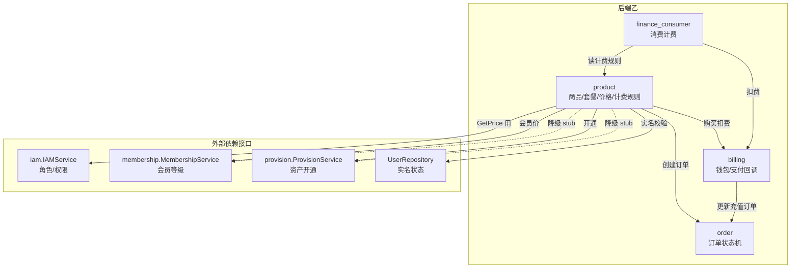
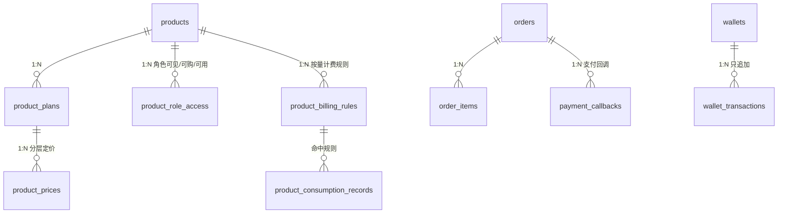

# 后端乙开发架构与接口设计（product / order / billing / finance_consumer）

> **定位**：后端工程师乙（`backend-b`）的权威架构与接口规范，覆盖商品市场、订单状态机、钱包计费、支付回调、按量消费五大能力。
> **制定日期**：2026-06-15　|　**适用范围**：后端乙开发、前端甲/乙对接、测试验收
> **设计方法**：senior-architect（模块化单体 + 分层架构 + 显式依赖注入）
> **对齐基线**：Round 7（D-95 扁平分页）已在后端甲落地，本文档将其姊妹问题在乙侧一并闭环，并补齐文档已约定但代码缺失的接口，使「整个系统完整」。

---

## 1. 架构总览

### 1.1 模块定位与边界

后端乙负责「交易与计费」域，由四个相互协作的模块组成。遵循**模块化单体**：单进程单库，模块间只经 `service` 接口调用，禁止跨模块直接访问 `repository`。

| 模块 | 职责 | 不负责（边界外） |
|---|---|---|
| `product` | 商品/套餐/价格/角色访问规则 CRUD、价格优先级计算、购买入口编排、计费规则（product_billing_rules）管理 | 钱包扣费、资产开通、消费事件接收 |
| `order` | 商品订单 + 充值订单的创建、状态机流转、查询、支付/取消 | 扣费实现、商品价格计算 |
| `billing` | 钱包余额/冻结、流水（只追加）、充值订单创建、支付回调验签与幂等入账、乐观锁扣费 | 商品订单业务（order）、消费事件（finance_consumer） |
| `finance_consumer` | 接收业务侧消费事件、匹配计费规则、调用 billing 扣费、写消费记录、消费记录查询 | 钱包扣费实现、计费规则维护（product 模块管理） |

> **跨域依赖（属丙，非乙）**：`GET /api/my/products`（我的商品+资产）、`GET /api/admin/product-handlers`（商品处理器）由 provision/asset（后端丙）实现，本文档不纳入乙范围，仅在编排链路中以 `ProvisionService` 接口形式被 product 调用。

### 1.2 模块依赖图



> 关键约束：**依赖单向**——`product → {order, billing}`、`finance_consumer → {billing, product(rule repo)}`、`billing → order(repo)`。无环。`provision`/`membership` 未注入时由 `stub` 降级为空操作，保证乙可独立编译与联调。

### 1.3 分层架构（每模块统一）

```
route.go            路由注册 + 中间件装配 + 依赖注入
  └─ handler/       HTTP 出入参解析、状态码、统一响应（不含业务规则）
       └─ service/  业务规则、事务边界、状态机、幂等、跨模块编排
            └─ repository/  数据访问（GORM），唯一可写库的层
                 └─ model/  GORM 实体 ；dto/ 出入参契约
```

铁律：① 事务边界只在 `service`；② `handler` 不写库；③ 跨模块只调对方 `service` 接口（定义在 `service/interfaces.go`）；④ 金额一律 `shopspring/decimal`，DB `DECIMAL(18,6)`，JSON 以字符串传递避免浮点误差。

---

## 2. 数据模型（ER 概览）



| 表 | 关键字段 | 约束/索引 |
|---|---|---|
| `products` | product_type, product_code(uk), name, status(draft/active/inactive), business_ref_id | uk_products_code、idx(type,status) |
| `product_plans` | product_id, plan_code, billing_type(one_time/monthly/yearly/usage), duration_days, quota_json, status | uk(product_id,plan_code) |
| `product_prices` | product_plan_id, role_id?, membership_level_id?, price_amount, currency | idx(plan_id/role_id/level_id)；**优先级：会员价>角色价>默认价** |
| `product_role_access` | product_id, role_id, can_view/can_buy/can_use | uk(product_id,role_id) |
| `product_billing_rules` | product_id, product_plan_id?, usage_type, usage_unit, price_amount, billing_mode, free_quota?, status | idx(product_id) |
| `orders` | order_no(uk), user_id, order_type(product/recharge), status, amount, idempotency_key(uk), paid_at/cancelled_at/failed_at | uk(order_no)、uk(idempotency_key) |
| `order_items` | order_id, product_id, product_plan_id, quantity, unit_price, total_price | idx(order_id) |
| `wallets` | user_id, balance_amount, frozen_amount, currency, **version（乐观锁）** | uk(user_id) |
| `wallet_transactions` | wallet_id, user_id, type(recharge/consume/refund/freeze/unfreeze), direction(in/out), amount, balance_after, related_order_id?, remark | idx(user_id,created_at)；**只追加，禁改禁删** |
| `payment_callbacks` | order_id, provider, provider_trade_no(uk), notify_body(AES-256-GCM), status(received/processed/ignored), processed_at | uk(provider,provider_trade_no) |
| `product_consumption_records` | event_id, user_id, product_id, product_plan_id, instance_id, usage_type, usage_amount, amount, idempotency_key(uk) | uk(idempotency_key) 幂等 |

---

## 3. 完整接口清单（目标契约）

> 标注说明：✅ 已实现且符合契约　｜　🔧 已实现但需修正（分页/字段）　｜　🆕 文档已约定、代码缺失，本次需新增。
> 所有列表接口统一返回 **D-95 扁平分页** `data: { items, page, page_size, total }`。

### 3.1 product 模块

| # | 方法/路径 | 权限 | 状态 | 说明 |
|---|---|---|---|---|
| P1 | `GET /api/products` | 登录 | 🔧 分页扁平化 | 商品市场，按角色 can_view 过滤；query: product_type, keyword, page, page_size |
| P2 | `GET /api/products/{id}` | 登录 | ✅ | 详情 + 套餐 + 用户实际价格 + 是否可购买 |
| P3 | `GET /api/products/{id}/plans` | 登录 | ✅ | 套餐列表（含 user_price） |
| P4 | `POST /api/products/{id}/purchase` | 登录 | ✅ | 购买；Header `Idempotency-Key` 必填；body: plan_id, quantity, remark |
| P5 | `GET /api/admin/products` | product:view | 🔧 分页扁平化 | query: product_type, status, keyword, page, page_size |
| P6 | `POST /api/admin/products` | product:create | ✅ | 创建，返回 product_id |
| P7 | `GET /api/admin/products/{id}` | product:view | ✅ | 详情 |
| P8 | `PATCH /api/admin/products/{id}` | product:edit | ✅ | 改 name/description/business_ref_id |
| P9 | `PATCH /api/admin/products/{id}/status` | product:edit | ✅ | 上下架 active/inactive |
| P10 | `GET /api/admin/products/{id}/plans` | product:view | 🔧 权限码 | **现用 product:create，应改 product:view** |
| P11 | `POST /api/admin/products/{id}/plans` | product:create | ✅ | 新增套餐 |
| P12 | `PATCH /api/admin/products/{id}/plans/{plan_id}` | product:edit | ✅ | 改套餐 |
| P13 | `PATCH /api/admin/products/{id}/access` | product:edit | 🔧 字段 | 批量覆盖角色访问；body `{ items:[{role_id,can_view,can_buy,can_use}] }`（统一 `items`，替换现 `accesses`） |
| P14 | `PATCH /api/admin/products/{id}/prices` | product:edit | 🔧 字段 | 批量覆盖价格；body `{ items:[{product_plan_id,role_id?,membership_level_id?,price_amount,currency}] }`（统一 `items`，替换现 `prices`） |
| P15 | `GET /api/admin/product-billing-rules` | product:view | 🆕 | 计费规则列表；query: product_id, status, page, page_size |
| P16 | `POST /api/admin/product-billing-rules` | product:create | 🆕 | 新增计费规则；body: product_id, product_plan_id?, usage_type, usage_unit, price_amount, currency, billing_mode, free_quota?, status |
| P17 | `PATCH /api/admin/product-billing-rules/{id}` | product:edit | 🆕 | 改计费规则 |

### 3.2 order 模块

| # | 方法/路径 | 权限 | 状态 | 说明 |
|---|---|---|---|---|
| O1 | `GET /api/orders` | 登录 | 🔧 分页+过滤 | 仅本人；query: order_type, status, created_from, created_to, page, page_size |
| O2 | `GET /api/orders/{id}` | 登录 | ✅ | 仅本人；含 order_items |
| O3 | `POST /api/orders/{id}/pay` | 登录 | 🆕 | 钱包支付存量 pending 订单；Header `Idempotency-Key`；body `{ pay_method:"wallet" }`；返回 order_id,status,wallet_transaction_id,asset_id |
| O4 | `POST /api/orders/{id}/cancel` | 登录 | 🆕 | 取消 pending 订单；body `{ reason }`；返回 `{ cancelled:true }` |
| O5 | `GET /api/admin/orders` | order:list | 🔧 分页+过滤 | query: user_id, order_type, status, created_from, created_to, page, page_size |
| O6 | `GET /api/admin/orders/{id}` | order:list | ✅ | 订单详情 |

### 3.3 billing 模块

| # | 方法/路径 | 权限 | 状态 | 说明 |
|---|---|---|---|---|
| B1 | `GET /api/wallet` | 登录 | ✅ | 返回 wallet_id, balance_amount, frozen_amount, currency |
| B2 | `GET /api/wallet/transactions` | 登录 | 🔧 分页+过滤 | query: type, direction, created_from, created_to, page, page_size |
| B3 | `POST /api/recharge/orders` | 登录 | 🔧 响应字段 | body: amount, payment_method(wechat/alipay), return_url?；返回 **order_id, order_no, amount, status, pay_url**（补 order_no/amount/status） |
| B4 | `POST /api/payments/notify/{provider}` | 无（验签） | ✅ | 第三方异步回调；验签+幂等+按协议返回成功标志 |
| B5 | `GET /api/admin/users/{id}/wallet` | wallet:view | ✅ | 指定用户钱包 |
| B6 | `GET /api/admin/wallet-transactions` | wallet:view | 🔧 分页扁平化 | 全量流水；query 同 B2 + user_id |
| B7 | `PATCH /api/admin/users/{id}/wallet/freeze` | wallet:manage | 🔧 字段+权限 | body `{ action:"freeze"/"unfreeze", amount, reason }`（remark→reason）；**权限码 wallet:view→wallet:manage** |
| B8 | `GET /api/admin/payment-callbacks` | wallet:view | 🔧 分页扁平化 | 回调记录；响应**禁止**返回明文 notify_body |

### 3.4 finance_consumer 模块

| # | 方法/路径 | 权限 | 状态 | 说明 |
|---|---|---|---|---|
| F1 | `POST /api/internal/product-usage-events` | IP 白名单 | 🔧 响应字段 | 内部上报；Header `Idempotency-Key`；返回 **consumption_record_id, wallet_transaction_id, amount, idempotency_key** |
| F2 | `GET /api/product-consumption-records` | 登录 | 🆕 | 用户查本人消费记录；query: product_id, usage_type, created_from, created_to, page, page_size |
| F3 | `GET /api/admin/product-consumption-records` | wallet:view | 🆕 | 管理员查全量消费记录；query 同 F2 + user_id |

### 3.5 接口契约修正点（与现状差异汇总）

| 编号 | 差异 | 现状 | 目标 | 影响前端 |
|---|---|---|---|---|
| C-1 | 列表分页结构 | 嵌套 `{list,pagination:{...}}` | 扁平 `{items,page,page_size,total}` | 是（甲/乙控制台对接乙列表） |
| C-2 | 批量访问/价格 body 键名 | `accesses` / `prices` | 统一 `items` | 是（admin-console 商品配置页） |
| C-3 | 充值响应字段 | `{order_id,pay_url}` | `{order_id,order_no,amount,status,pay_url}` | 是（user-console 充值页） |
| C-4 | 冻结请求 body | `{amount,action,remark}` | `{action,amount,reason}` | 是（admin-console 钱包冻结） |
| C-5 | 消费响应字段 | `{record_id,amount,idempotency_key}` | `{consumption_record_id,wallet_transaction_id,amount,idempotency_key}` | 否（内部接口） |
| C-6 | 计费规则管理接口 | 缺失 | P15/P16/P17 | 是（admin-console 计费规则页） |
| C-7 | 消费记录查询接口 | 缺失 | F2/F3 | 是（两端控制台） |
| C-8 | 订单支付/取消 | 缺失 | O3/O4 | 是（user-console 订单页） |
| C-9 | 套餐列表权限码 | product:create | product:view | 否 |
| C-10 | 冻结权限码 | wallet:view | wallet:manage（需 seed migration） | 否 |

---

## 4. 核心流程

### 4.1 购买编排（product.PurchaseService）

```
POST /api/products/{id}/purchase  (Idempotency-Key 必填)
 1. 实名校验    user.RealNameStatus=="verified" 否则 70001
 2. 购买权限    product_role_access.can_buy（按用户角色）否则 40003
 3. 商品/套餐可用 products.status==active && plans.status==active 否则 60003
 4. 价格计算    PricingService.GetPrice（会员价>角色价>默认价）× quantity
 5. 幂等检查    orders.idempotency_key 命中 → 返回原订单 (idempotent:true)
 6. 创建订单    OrderService.Create → status=pending + order_items
 7. 扣费        billing.WalletService.Deduct（乐观锁事务，余额不足 60001）
      ├─ 失败 → OrderService.MarkFailed → 返回错误
      └─ 成功 → OrderService.MarkPaid
 8. 开通        provision.Provision（异步，幂等，可重放）
 9. 返回        order_id, order_no, status, amount, asset_id
```

> **一致性**：步骤 6-7 中「下单」与「扣费」分属 order/billing 两模块，第一阶段以「扣费失败即置订单 failed」补偿保证最终一致；扣费成功后 MarkPaid 失败属极端异常，靠对账修复（不引入分布式事务）。

### 4.2 订单状态机（严格，越界即 Bug）

```
pending ──支付成功──▶ paid ──退款(二期)──▶ refunded
   │
   ├──用户取消/超时──▶ cancelled
   └──系统错误──────▶ failed
```

所有流转用 `UPDATE ... WHERE id=? AND status='pending'` 的 `RowsAffected==0` 判定非法跳转，杜绝竞态。O3 支付仅允许 `pending→paid`，O4 取消仅允许 `pending→cancelled`。

### 4.3 钱包扣费（billing.WalletService.Deduct）

乐观锁事务：`SELECT ... FOR UPDATE` → 校验余额（不足 60001）→ `UPDATE ... SET balance=balance-?, version=version+1 WHERE id=? AND version=?` → `RowsAffected==0` 则乐观锁冲突，调用方**重试最多 3 次** → 写 wallet_transactions（balance_after 快照）。提供 `DeductTx(tx,...)` 供 finance_consumer 在同一事务内复用。

### 4.4 支付回调幂等（billing.PaymentService.HandleNotify）

```
收到回调 → 验签（微信 AEAD_AES_256_GCM / 支付宝 RSA2，失败 HTTP 400）
 → 写 payment_callbacks(status=received, notify_body 加密)
 → 按 (provider,provider_trade_no) 查是否已 processed → 是则直接返回成功
 → 查关联 order，校验状态与金额
 → 事务：order→paid、wallet 入账(Recharge)、写流水、callback→processed
 → 按第三方协议返回成功标志（微信 {"code":"SUCCESS"}）
```

> 严禁回调内做耗时操作；报文 AES-256-GCM 加密入 `payment_callbacks.notify_body`，API 响应禁止回传明文。

### 4.5 按量消费（finance_consumer.ConsumerService.Handle）

```
POST /api/internal/product-usage-events (IP 白名单 + Idempotency-Key)
 1. 幂等检查  idempotency_key 命中 product_consumption_records → 返回原结果
 2. 匹配规则  product_billing_rules(product_id,plan_id,usage_type) 否则 ErrNoBillingRule
 3. 计算金额  扣除 free_quota 后 amount = price_amount × billable_usage（≤0 拒绝）
 4. 事务      billing.DeductTx + 写 product_consumption_records
 5. 返回      consumption_record_id, wallet_transaction_id, amount
```

---

## 5. 依赖注入与对外接口（service/interfaces.go）

product 模块对外依赖的接口（由 bootstrap/app.go 注入实现）：

```go
type IAMService interface {                     // 由 iam 模块实现
    GetUserRoleIDs(ctx, userID) ([]uint64, error)
    CheckPermission(ctx, userID, code) (bool, error)
}
type BillingService interface {                 // 由 billing.WalletService 实现
    Deduct(ctx, userID, amount, orderID, remark) error
}
type MembershipService interface {              // 由 membership 实现，nil→stub
    GetActiveLevelID(ctx, userID) (*uint64, error)
}
type ProvisionService interface {               // 由 provision 实现，nil→stub
    Provision(ctx, orderID, productID, planID, userID) error
}
type UserRepository interface {                 // 实名状态
    FindByID(ctx, userID) (*User, error)        // 含 RealNameStatus
}
```

billing 对外暴露 `NewWalletService(db)` 供 product / finance_consumer 注入。注入装配集中在 `server/internal/bootstrap/app.go`（乙仅注册自身路由与依赖，不改他人模块）。

---

## 6. 安全与质量约定（红线）

- **支付回调报文**：AES-256-GCM 加密存 `payment_callbacks.notify_body`（密钥来自 `NotifyBodyKey` 环境变量），API 禁止回传明文。
- **金额**：全程 `decimal`，JSON 字符串传参；DB `DECIMAL(18,6)`；禁止 float。
- **钱包**：扣费/入账必须事务 + 乐观锁；流水只追加；冻结/解冻经 `action` 区分并写流水。
- **幂等**：购买（Idempotency-Key + orders 唯一键）、支付回调（provider_trade_no 唯一键）、消费（idempotency_key 唯一键）三处必须幂等。
- **权限码 seed**：新增/变更权限码（如 `wallet:manage`）必须同时建 seed migration（历史多次因缺 seed 导致 P1，见记忆 feedback-permission-code-seeding）。
- **D-95 扁平分页**：所有列表接口（含新增）必须扁平结构，禁止再写嵌套。
- **字段变更同步前端**：C-1~C-8 涉及前端契约变更，落地后必须同步 `frontend-api-reference.md` 与两端控制台对接说明（接口字段变更未同步前端为反复出现根因）。

---

## 7. 任务分解（分阶段，每阶段独立 feature 分支 + PR）

| 阶段 | 分支 | 内容 | 验收要点 |
|---|---|---|---|
| R1 | `feature/backend-b-d95-pagination-flat` | C-1：product/order/billing 全部 list 改匿名嵌入扁平分页 | 所有列表返回 `{items,page,page_size,total}`，回归测试通过 |
| R2 | `feature/backend-b-contract-fixes` | C-2/C-3/C-4/C-5/C-9：批量 body 改 `items`、充值/冻结/消费响应字段对齐、套餐权限码 | 字段与 full-api-design §4 一致 |
| R3 | `feature/backend-b-order-pay-cancel` | C-8：O3 支付、O4 取消，状态机守卫 | pending→paid / pending→cancelled，越界拒绝 |
| R4 | `feature/backend-b-billing-rules-admin` | C-6：P15/P16/P17 计费规则 CRUD（product 模块） | 规则列表/新增/修改，权限码就位 |
| R5 | `feature/backend-b-consumption-records` | C-7：F2/F3 消费记录查询 | 用户/管理员分页查询，数据范围隔离 |
| R6 | `feature/backend-b-wallet-manage-perm` | C-10：`wallet:manage` 权限码 + seed migration，冻结接口切换 | seed 生效，admin 角色具备该权限 |

> 实现由「后端工程师乙」按上表逐阶段开发，经测试验收 + 产品经理确认后合入 main（阶段门禁原则）。

---

## 8. 与现有文档的关系

| 文档 | 关系 |
|---|---|
| `docs/full-api-design.md` §4 | 接口契约权威来源；本次同步 C-2~C-5、新增 P15-17/O3-4/F2-3 |
| `docs/api-pagination-standard.md` | 分页规范；本文档明确乙侧 R1 迁移后全量生效 |
| `server/internal/modules/{product,order,billing,finance_consumer}/CLAUDE.md` | 模块级开发规范；接口清单已同步本文档 |
| `docs/frontend-api-reference.md` | 前端契约；C-1~C-8 落地后需同步 |
| `.claude/agents/后端工程师乙.md` | agent 任务与红线，已按本文档刷新 |
