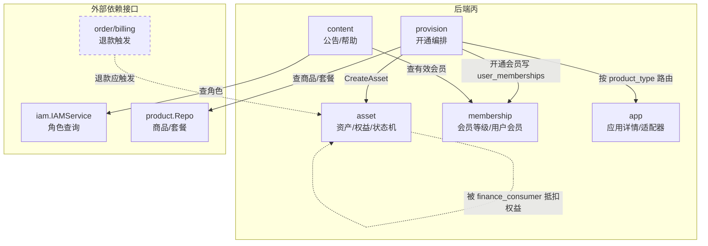

# 后端丙开发架构与接口设计（asset / membership / app / provision / content）

> **定位**：后端工程师丙（`backend-c`）的权威架构与接口规范，覆盖用户资产、会员体系、应用市场、商品开通编排、内容（公告/帮助）五大能力。
> **制定日期**：2026-06-17　|　**适用范围**：后端丙开发、前端甲/乙对接、测试验收
> **设计方法**：senior-architect（模块化单体 + 分层架构 + 显式依赖注入 + 状态机）
> **对齐基线**：Round 7（D-95 扁平分页、批量 `items` 键、契约一致性、权限码 seed 同步）已在后端甲/乙落地；本文档将其姊妹问题在丙侧一并清查并闭环，并补齐「规划已约定但代码缺失 / 业务链路断裂」的接口，使整个系统端到端完整。

---

## 1. 架构总览

### 1.1 模块定位与边界

后端丙负责「资产与内容」域，由五个模块组成。遵循**模块化单体**：单进程单库，模块间只经 `service` 接口调用，禁止跨模块直接访问 `repository`；跨模块依赖一律通过 `bootstrap/app.go` 的 adapter 做接口适配，避免循环导入。

| 模块 | 职责 | 不负责（边界外） |
|---|---|---|
| `asset` | 用户资产创建/查询/状态机（active/suspended/expired/cancelled）、权益额度（entitlement）管理与并发安全消耗、资产事件审计 | 商品开通路由（provision 调用 asset）、会员权益（membership） |
| `membership` | 会员等级/权益配置、用户会员开通/续期/查询、为定价提供"会员等级"判定 | 会员购买支付（product/order）、会员资产生成（asset） |
| `app` | 应用业务详情（图标/描述/回调/适配器配置）CRUD、适配器注册 | 商品交易（套餐/价格/角色权限走 product）、应用开通（provision） |
| `provision` | 按 `product_type` 路由到对应 `ProvisionHandler`、开通成功后调用 asset 创建资产；提供续期/暂停/恢复/取消编排 | 扣费（billing）、订单状态（order）、具体业务实现（各 Provisioner） |
| `content` | 系统公告、帮助文档分类/文章的发布与查询、按 `visible_scope` 可见范围过滤 | 用户角色/会员判定（依赖 iam/membership） |

### 1.2 模块依赖图

> 图中**虚线**为**本阶段不接通的链路**（LATER）：退款触发资产取消依赖乙落地 `paid→refunded`（C-FIX-2b）；权益抵扣为未立项的买断配额功能（C-FIX-3）。详见 §3.4。

### 1.3 当前实现现状（代码审查结论，2026-06-17）

五个模块均已落地 model/repository/service/handler/route 全套，并在 `bootstrap/app.go` 完成依赖注入与路由注册；迁移 `000007~000011` 建表与 `app:manage` seed、`000019` 补 `asset:*/membership:*/content:*` 权限码均已就位；`jobs/expire_assets.go` 资产到期任务已 `go` 启动（`app.go:318`）。

| 模块 | 规划接口（CLAUDE.md） | 实际实现 | 差异 |
|---|---|---|---|
| asset | 6 个（含 freeze/unfreeze） | 6 个，全部实现 | 缺 `cancelled` 落地路径（见 C-FIX-2a） |
| membership | 12 个（含 purchase、product-membership-rules×3） | 7 个 | purchase、product-membership-rules 未实现（设计冗余，正式移除，见 C-OPT-1/2）；续期未实现（见 C-FIX-1） |
| app | 8 个 | 8 个，全部实现 | 用户端详情要求登录（见 C-OPT-3） |
| provision | 内部接口（无 HTTP） | Provision 已实现 | Renew/Suspend/Resume/Cancel 为空实现（Cancel 本阶段补，见 C-FIX-2a） |
| content | 13 个 | 13 个，全部实现 | 用户端公告全表内存过滤、无分页（见 C-FIX-6） |

**结论**：C-01/C-02 已验收；**C-03/C-04/C-05 的代码主体已存在**（与 B-03~B-06 情形一致），dev-tasks.md 标记为"待开始"属状态滞后。本次 senior-architect 审查 + 复评后，**本阶段须清零**：1 项 P1（C-FIX-1 会员续期）+ 4 项 P2（C-FIX-4/5/6/2a）；另有 3 项 OPT（文档/体验）与 2 项 LATER（C-FIX-2b/C-FIX-3，依赖外部条件，不立项）。

---

## 2. 设计原则（丙侧红线）

1. **状态变更必写事件**：资产状态机每次流转（含 cancelled）必须写 `asset_events`，会员每次流转写审计可追溯字段。
2. **额度消耗并发安全**：`user_entitlements.quota_used` 的递增必须 `SELECT ... FOR UPDATE` 行锁 + 事务，禁止读改写竞态。
3. **定价单一来源**：会员价由 `product_prices`（会员档）唯一承载，**不引入第二套** `product_membership_rules`（见 C-OPT-1）。
4. **购买入口单一**：所有付费开通（含会员）统一走 `product`→`order`→`provision`，membership/app 模块**不开放独立 purchase 接口**（见 C-OPT-2）。
5. **列表契约一致**：所有列表返回 `{items, page, page_size, total}` 扁平结构（D-95），管理端分页接口**四个字段缺一不可**（见 C-FIX-4）。
6. **可见范围 fail-closed**：公告 `visible_scope` 未知取值默认不可见；用户端过滤依赖的 iam/membership 适配器为 nil 时降级为"仅 all 可见"，禁止泄露 roles/members/admins 范围内容。
7. **权限码必带 seed**：`RequirePerm` 新增权限码必须同步 seed migration（历史多次 P1 根因）。

---

## 3. 架构审查：缺陷与优化（按优先级）

> 评级：**P1**=纯丙范围的真实缺陷/数据不一致（本阶段必做）；**P2**=契约/健壮性（应修）；**OPT**=规划冗余与体验优化；**LATER**=依赖外部条件、本阶段不立项。
>
> **复评修订（2026-06-17）**：初版将 C-FIX-2、C-FIX-3 列为 P1，复评后判定——C-FIX-3（买断配额消耗）是**未接通的半成品功能**而非链路 bug，且原"方案 A"越过 finance_consumer（乙）边界，整体降为 **LATER**；C-FIX-2 的"退款联动"上游（order `paid→refunded`）被乙标注"第一阶段暂不实现"，故**拆分**为"管理员手动取消（P2）"+"退款自动联动（LATER，随乙退款落地）"。详见 §3.4。

### P1 — 纯丙范围真实缺陷

#### C-FIX-1　会员续期未实现，重复购买产生多条 active 记录
- **现状**：`MembershipService.CreateUserMembership` 永远 `INSERT` 新行（`membership_service.go:50`）；同一用户重复购买同一等级会产生**多条 active** `user_memberships`。`GetActiveMembership`→`FindActive` 无 `ORDER BY`，命中哪条不确定；`user_memberships` 无 `(user_id, level_id)` 唯一约束兜底。
- **影响**：C-03 任务明确要求"开通/**续期**/查询"，续期语义缺失；到期续费无法延长，定价/权益判定可能读到任意一条记录。
- **修复方案**：
  - `CreateOrRenewMembership(userID, levelID, assetID, duration)`：事务内 `SELECT ... FOR UPDATE` 查同一 `(user_id, level_id)` 的 active 记录——存在则 `expires_at = max(now, 旧 expires_at) + duration`（叠加续期）；不存在则新建。
  - 迁移补 `uk_user_memberships_user_level_active`（或应用层加锁）防并发双插。
  - `FindActive` 增加 `ORDER BY expires_at DESC` 明确语义。

> **C-FIX-2 / C-FIX-3 已于 2026-06-17 复评降级**：原 P1 两项移出本节——C-FIX-2 拆为 §3.2 **C-FIX-2a（P2，管理员手动取消）** + §3.4 **C-FIX-2b（LATER，退款联动）**；C-FIX-3 整体移至 §3.4 **LATER（买断配额，未立项）**。

### P2 — 契约与健壮性

#### C-FIX-2a　资产 `cancelled` 状态无落地路径（管理员手动取消）
- **现状**：状态机声明 `active → cancelled`，但 `asset_service.go` 只有 Expire/Freeze/Unfreeze，**无 `CancelAsset`**；`AdminUpdateAsset` 仅支持 `freeze/unfreeze`。
- **影响**：管理员无法撤销/作废已开通资产（误开通、客诉、人工退款后处理），状态机声明与实现不符。
- **修复方案（纯丙范围，不依赖乙）**：
  - asset 补 `CancelAsset(assetID, operatorID, reason)`：`active|suspended → cancelled`，同步将关联 entitlement 置 `cancelled`，写 `asset_events`（event_type=`cancelled`）。
  - `AdminUpdateAsset` 扩展 `action: cancel`（带 `reason`）。
  - provision 的 `Cancel` 由空实现补为调用 `asset.CancelAsset` 的最小编排，**预留**给未来退款自动联动（C-FIX-2b）复用，本阶段仅管理端手动触发。

#### C-FIX-4　管理端列表分页信封缺 `page_size`（D-95 红线违反，系统性）
- **现状**：`asset/membership/content/app` **全部** admin 列表 handler 返回 `{items, total, page}`，**统一缺 `page_size`**（asset_handler.go:112、membership:226、content:137/301、app:70/179）。
- **影响**：违反 `docs/api-pagination-standard.md` 的 `{items,page,page_size,total}` 红线；前端无法回显每页条数。
- **修复方案**：统一在四模块 admin 列表响应补 `"page_size": pageSize`。一次性清理，并入回归用例。

#### C-FIX-5　会员状态过期无定时任务，`status` 长期陈旧
- **现状**：资产有 `ExpireAssetsJob` 每小时流转，**会员没有**；`user_memberships.status` 过期后仍为 `active`，仅靠查询期 `expires_at>NOW()` 掩盖。`AdminListUserMemberships` 展示陈旧 active。
- **修复方案**：新增 `ExpireMembershipsJob`（或扩展现有 job 为统一过期扫描器）：`status=active AND expires_at<NOW() → expired`，每小时批量、限 1000 条，与资产任务对齐。

#### C-FIX-6　用户端公告全表内存过滤、无分页
- **现状**：`ContentService.ListAnnouncements` 一次 `ListPublished()` 拉全部已发布公告再在 Go 内存逐条 `isVisible` 过滤（content_service.go:33），无 `limit`、无分页。
- **影响**：公告量增长后内存与响应体膨胀；可见范围过滤为 O(N×roles)。
- **修复方案**：SQL 层先过滤 `status=published AND 时间窗`，`visible_scope` 中 `all/members/admins` 下推 SQL，`roles` 命中保留应用层；增加 `page/page_size`（默认 20，上限 50），返回扁平分页信封。

### OPT — 规划冗余与体验优化

#### C-OPT-1　移除 `product_membership_rules`（与 product_prices 会员档重叠）
- membership/CLAUDE.md 规划的 `product_membership_rules` 表 + 3 个 admin 接口未实现，且会员价已由后端乙 `product_prices`（会员档，优先级：会员>角色>默认）唯一承载。**正式从规划移除**，避免双写定价来源、口径分裂。本文档 §6 接口清单不含该接口。

#### C-OPT-2　移除 membership/app 模块的独立 purchase 接口
- `POST /api/memberships/:id/purchase` 规划在 membership，实际购买走 `product`（`product_type=membership`，`business_ref_id` 指向会员等级）→`order`→`provision`→`membership.CreateOrRenewMembership`。统一购买入口，membership/app **不开放** purchase。文档明确删除。

#### C-OPT-3　应用市场详情登录要求
- `GET /api/marketplace/apps/{id}` 当前要求登录，与"匿名浏览市场"体验不一致。建议放开为公开只读（仅返回 `status=active` 应用的展示字段），与商品市场列表对齐。属体验优化，非阻塞。

### LATER — 依赖外部条件，本阶段不立项

#### C-FIX-2b　退款 → 资产自动取消（随乙退款落地）
- **现状**：order 的 `paid→refunded` 被后端乙明确标注"第一阶段暂不实现"（`order/model/order.go:15`）；billing 已具备钱包退款流水类型（`refund`），但无订单级退款编排。
- **判定**：本阶段**全系统无退款触发点**，丙侧无法、也不应先行实现"退款联动"。
- **触发条件**：待乙落地 `paid→refunded` 退款编排后，由其在退款成功后调用 `provision.Cancel`→`asset.CancelAsset`（C-FIX-2a 已预留该编排入口），形成闭环。届时立项为独立任务。

#### C-FIX-3　买断配额（user_entitlements）消耗，未接通的半成品功能
- **现状**：`user_entitlements` 表、provision 开通时按 `quota_json` 写权益、`AssetService.ConsumeEntitlement`（行锁完整）均已存在，但**全仓库无任何消费触发点**。当前系统唯一消费路径是 finance_consumer 按量扣**钱包**（乙已完整实现，含 `free_quota` 免费额度）。
- **复评判定**：这是**从未接通的功能**，而非"断裂的 bug"——
  1. 本阶段无任何商品采用"买断配额池"计费模型，按量计费（钱包）已覆盖现有需求；
  2. `free_quota`（乙·每次事件免费门槛）与 `user_entitlements`（买断递减池）是两套正交机制，不重叠、不互替；
  3. 原"方案 A（finance_consumer 优先抵扣权益）"**越过 finance_consumer 边界**（其 CLAUDE.md 明确"不负责资产额度更新"），**作废**。
- **触发条件（确有买断商品需求时再立项）**：只走 **丙自有内部接口** `POST /api/internal/entitlement-consume`（仿 F1 鉴权：`X-Internal-Token` + IP 白名单 + 幂等键），由业务侧直接上报；同时补 `ConsumeEntitlementBy(userID, productID, entitlementType, amount, idemKey)`（按业务维度定位、选最早到期 active 权益、幂等）。**不**改 finance_consumer。

---

## 4. 优化后的接口契约（最终版）

> 通用约定：列表一律 `{items, page, page_size, total}`；金额/配额用字符串十进制；时间 RFC3339；错误体 `{code, message}`。权限码：`asset:view/asset:manage`、`membership:view/membership:manage`、`content:manage`、`app:manage`（均已 seed）。

### 4.1 asset（资产 / 权益）

| 方法 | 路径 | 鉴权 | 说明 |
|---|---|---|---|
| GET | `/api/my/assets` | 登录 | 我的资产列表，可选 `?status=` |
| GET | `/api/my/assets/{id}` | 登录 | 资产详情（越权返回 403） |
| GET | `/api/my/entitlements` | 登录 | 我的权益额度（含 quota_total/used/unit） |
| GET | `/api/admin/assets` | asset:view | 全量资产，filter `user_id/status`，分页 |
| GET | `/api/admin/users/{id}/assets` | asset:view | 指定用户资产 |
| PATCH | `/api/admin/assets/{id}` | asset:manage | `action: freeze \| unfreeze \| cancel`（cancel 为 C-FIX-2a 新增） |

**内部能力（非 HTTP，供 provision 注入）**：
- `CancelAsset(assetID, operatorID, reason)`（C-FIX-2a，本阶段做）
- `ConsumeEntitlementBy(...)`、内部接口 `POST /api/internal/entitlement-consume`（**LATER**，仅在确有买断配额商品时立项，见 §3.4 C-FIX-3）

### 4.2 membership（会员）

| 方法 | 路径 | 鉴权 | 说明 |
|---|---|---|---|
| GET | `/api/memberships` | 公开 | active 会员等级列表（用户端展示） |
| GET | `/api/memberships/{id}/benefits` | 公开 | 某等级的 active 权益列表；等级不存在/未上架返回 404/40400（#168） |
| GET | `/api/my/membership` | 登录 | 我的当前有效会员（无则 `{membership:null}`）；会员对象内联 `level_code`/`level_name`（#168） |
| GET | `/api/admin/membership-levels` | membership:view | 全部等级 |
| POST | `/api/admin/membership-levels` | membership:manage | 创建等级 |
| PATCH | `/api/admin/membership-levels/{id}` | membership:manage | 修改等级 |
| GET | `/api/admin/membership-benefits` | membership:view | 权益列表，可选 `?level_id=` |
| POST | `/api/admin/membership-benefits` | membership:manage | 创建权益 |
| PATCH | `/api/admin/membership-benefits/{id}` | membership:manage | 修改权益 |
| GET | `/api/admin/user-memberships` | membership:view | 用户会员列表，filter `user_id`，分页；items 内联 `level_code`/`level_name`（批量加载，无 N+1，#168） |
| POST | `/api/admin/user-memberships` | membership:manage | 手动开通/续期（M10，#154）；body `{user_id, level_id, duration_days}`，`duration_days=null` 永久；user_id 不存在返回 400（BUG-M10-01，#164） |
| PATCH | `/api/admin/user-memberships/{id}` | membership:manage | 取消/改期（M11，#154）；body `{action:"cancel"}` 或 `{expires_at}` |

**内部能力**：`CreateOrRenewMembership(userID, levelID, assetID, duration)`（C-FIX-1，由 provision 调用）；`GetActiveMembership` / `HasActiveLevelIn`（供 product 定价/门槛判定）。
**响应契约要点**（#168/#169）：`my/membership` 与 `admin/user-memberships` 的会员对象在保留 `level_id` 基础上内联 `level_code`/`level_name`（等级查询异常时留空字符串，不阻断）；`asset_id` 为 `*uint64`、无关联资产时序列化为 `null`（key 恒在，不省略）；公开权益端点仅返回 `status=active` 权益、对 inactive/不存在等级 fail-closed 返 404 防泄露。
**已删除**（C-OPT-1/2）：`POST /api/memberships/:id/purchase`、`/api/admin/product-membership-rules`（×3）。会员购买统一走商品流程，membership/app 不开放 purchase。

### 4.3 app（应用 / 适配器）

| 方法 | 路径 | 鉴权 | 说明 |
|---|---|---|---|
| GET | `/api/marketplace/apps/{id}` | 登录（建议放开公开，C-OPT-4） | 应用业务详情 |
| GET | `/api/admin/apps` | app:manage | 应用列表，filter `status/type`，分页 |
| GET | `/api/admin/apps/{id}` | app:manage | 应用详情 |
| POST | `/api/admin/apps` | app:manage | 创建应用 |
| PATCH | `/api/admin/apps/{id}` | app:manage | 更新 / 上下架（draft/active/inactive/archived） |
| GET | `/api/admin/app-adapters` | app:manage | 适配器列表，filter `status`，**分页**（扁平 `{items,page,page_size,total}`，page_size 上限 100） |
| POST | `/api/admin/app-adapters` | app:manage | 注册适配器 |
| PATCH | `/api/admin/app-adapters/{id}` | app:manage | 更新 / 启停适配器 |

> 边界：`applications` 仅存业务详情；套餐/价格/角色权限走 product；上架为可购买商品需在商品管理新建 `product_type=application` 且 `business_ref_id` 指向应用 ID。

> **AP1 用户向白名单 DTO（响应契约）**：`GET /api/marketplace/apps/{id}` 用 `dto.MarketplaceAppResponse` 映射 `*model.Application` 后返回，响应 `data` 字段固定为 `{id, code, name, type, description, icon_url, status, created_at}`。**剔除 `callback_url`（内部回调地址）与 `adapter_config_json`（应用非交易配置，freeform JSON，可能含集成参数/内网地址/密钥），亦剔除 `updated_at`**，避免敏感配置过度暴露给登录用户。`status==active` 过滤与 404/40400 错误码保持不变；管理端 AP2/AP3（`/api/admin/apps`、`/api/admin/apps/{id}`）仍返回完整 `model.Application`。映射逻辑抽为纯函数 `dto.MapMarketplaceApp`，并有 `encoding/json` 序列化单测断言不含 `callback_url`/`adapter_config_json`。

### 4.4 content（公告 / 帮助）

| 方法 | 路径 | 鉴权 | 说明 |
|---|---|---|---|
| GET | `/api/announcements` | 登录 | 公告列表，按 `visible_scope` 过滤，**新增分页**（C-FIX-6） |
| GET | `/api/help/categories` | 公开 | active 帮助分类 |
| GET | `/api/help/articles` | 公开 | 已发布文章，可选 `?category_id=` |
| GET | `/api/help/articles/{id}` | 公开 | 文章详情（仅 published） |
| GET | `/api/admin/announcements` | content:manage | 全部公告，分页 |
| POST | `/api/admin/announcements` | content:manage | 创建公告（默认 draft） |
| PATCH | `/api/admin/announcements/{id}` | content:manage | 修改 / 发布 / 下线 |
| GET/POST/PATCH | `/api/admin/help/categories[/{id}]` | content:manage | 帮助分类 CRUD |
| GET/POST/PATCH | `/api/admin/help/articles[/{id}]` | content:manage | 帮助文章 CRUD |

`visible_scope`：`all`（所有登录用户）/`roles`（命中 `target_roles_json` 任一角色）/`members`（有效会员）/`admins`（用户端不可见）。

### 4.5 provision（开通编排，内部）

`ProvisionHandler` 接口：`Provision/Renew/Suspend/Resume/Cancel`。各商品类型实现并在 bootstrap 注册（`application` 已注册 `AppProvisioner`）。本阶段仅补 `Cancel` 为调用 `asset.CancelAsset` 的最小编排（供管理端取消，C-FIX-2a）；`Renew/Suspend/Resume` 维持占位，待对应业务场景（续期/暂停）立项时再补，避免提前实现无调用方的空编排。

---

## 5. 数据模型变更

| 变更 | 表 | 说明 | 关联 |
|---|---|---|---|
| 新增唯一/索引 | `user_memberships` | `(user_id, level_id)` 用于续期定位（应用层 FOR UPDATE 兜底）；`FindActive` 加 `ORDER BY expires_at DESC` | C-FIX-1 |
| 新增事件类型 | `asset_events` | `event_type=cancelled`（无需改表，枚举扩展） | C-FIX-2a |
| 无需改表（LATER） | `user_entitlements` | 仅在买断配额立项时：消费按 `user_id+product_id+entitlement_type` 查询，可加 `(user_id,product_id,status)` 复合索引 | C-FIX-3（LATER） |

> 本阶段新增 migration 仅 C-FIX-1 一项（`user_memberships` 续期定位索引），从当前最大序号 `000025` 之后递增（如 `000026_add_user_membership_unique_idx`）。本批无新增权限码，无需 seed。

---

## 6. 任务拆解与排期

> C-01/C-02 已验收；C-03/C-04/C-05 代码主体已存在（状态回填为"已实现"），但需先清零下列缺陷再标记完成。

| 编号 | 模块 | 任务 | 优先级 | 依赖 |
|---|---|---|---|---|
| C-03 | membership | 会员等级/权益 CRUD、用户会员查询（已实现，状态回填） | — | — |
| C-04 | asset | 资产创建/状态机/权益消耗（主体已实现，状态回填） | — | — |
| C-05 | content | 公告/帮助/可见范围过滤（已实现，状态回填） | — | — |
| **C-FIX-1** | membership | 会员续期 `CreateOrRenewMembership` + 唯一约束 + FindActive 排序 | **P1** | 无（纯丙） |
| **C-FIX-4** | 全模块 | admin 列表统一补 `page_size`（D-95 红线） | **P2** | 无 |
| **C-FIX-5** | membership | `ExpireMembershipsJob` 会员到期定时流转 | **P2** | 无 |
| **C-FIX-6** | content | 用户端公告 SQL 预过滤 + 分页 | **P2** | 无 |
| **C-FIX-2a** | asset/provision | 资产 `CancelAsset` + `action:cancel` + provision.Cancel 最小编排（管理员手动取消） | **P2** | 无（纯丙） |
| C-OPT-1 | membership/docs | 移除 product_membership_rules 规划（定价单一来源） | OPT | 文档（已改 CLAUDE.md） |
| C-OPT-2 | membership/app/docs | 移除独立 purchase 接口（购买入口单一） | OPT | 文档（已改 CLAUDE.md） |
| C-OPT-3 | app | 应用市场详情放开匿名只读（可选） | OPT | 无 |
| ~~C-FIX-2b~~ | order/billing(乙)+asset | 退款 → 资产自动取消联动 | **LATER** | 乙落地 `paid→refunded` |
| ~~C-FIX-3~~ | asset（自有内部接口） | 买断配额消耗打通（仅方案 B，不改 finance_consumer） | **LATER** | 确有买断商品需求 |

**建议批次**：①文档落地（本文件 + C-OPT-1/2 已同步修订 membership/asset 的 CLAUDE.md）→ ②**本阶段开发**：C-FIX-1（P1）+ C-FIX-4/5/6/2a（P2），均为纯丙范围、不依赖乙、不越界，可在一条 `feature/backend-c-defect-fixes` 分支或按模块拆 2~3 个 PR → ③测试工程师回归 → ④PR 经产品经理确认后合并 main。**LATER 两项不在本阶段**：触发条件满足时再单独立项。

---

## 7. 对接说明（前端 / 内部调用方）

- **前端甲（admin-console）**：资产管理（freeze/unfreeze/**cancel**）、会员等级/权益管理、公告/帮助 CMS、应用/适配器管理。列表统一消费 `{items,page,page_size,total}`；资产 PATCH `action` 枚举新增 `cancel`。
- **前端乙（user-console）**：我的资产/权益、会员中心（`/api/my/membership` 续期后 `expires_at` 会延长）、公告列表（新增分页参数 `page/page_size`）、帮助中心。
- **内部调用方**：本阶段消费上报维持现状——业务侧调用乙的 F1 `POST /api/internal/product-usage-events`，按量扣钱包（含 `free_quota` 免费额度），无新增对接。买断配额（`user_entitlements`）消耗为 LATER，确有需求时由丙单独开 `POST /api/internal/entitlement-consume`，**不经** finance_consumer。
- **契约同步**：本文档定稿后，§4 接口须同步进 `docs/frontend-api-reference.md` 的资产/会员/内容/应用章节；字段变更（如列表 `page_size`、PATCH `cancel`）须同步两端控制台，避免"字段变更未同步前端"的历史根因复发。
