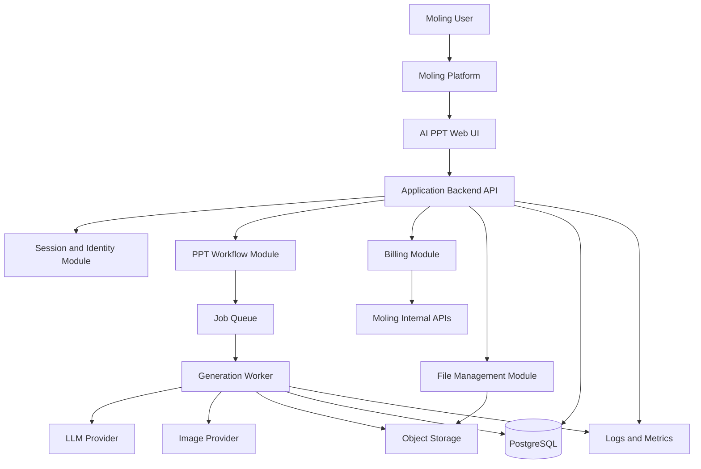

# System Architecture

## Architecture Style

Use a modular monolith for the application backend in the first production version. This keeps deployment simple while preserving clean module boundaries for future extraction.

The second-stage implementation establishes this foundation in `ppt-ai-app/src/` with small ESM modules for API, configuration, database, Moling client, billing, files, tasks, templates, AI provider abstraction, permissions, logging, and errors.

Primary layers:

- Web UI: authenticated product experience and generation workspace
- Backend API: session, task, billing orchestration, file metadata, and export APIs
- Domain services: PPT workflow, template selection, entitlement charging, file lifecycle, and audit logging
- Infrastructure adapters: Moling platform API, LLM providers, image providers, object storage, database, queue, and observability

## Component Diagram

## Main Runtime Services

- Web application: renders the user interface and calls backend APIs.
- API service: owns user sessions, authorization, task creation, state reads, and platform integration boundaries. The current foundation exposes health, entry, current user, template, file, and task endpoints.
- Worker service: executes long-running AI generation and export jobs asynchronously.
- Database: stores users as platform identities, projects, decks, slides, tasks, billing holds, files, and audit records.
- Object storage: stores uploaded documents, generated assets, PPTX/PDF exports, and thumbnails.
- Queue: decouples user requests from long-running generation work.

The current task center is an in-memory foundation adapter. Production queue integration remains a later phase.

## Boundary Rules

- Only the backend calls Moling internal APIs.
- Only the billing module can reserve, settle, release, or consume credits.
- Only file management can issue storage upload and download URLs.
- AI provider keys are used only by worker-side provider adapters.
- UI never receives `INTERNAL_API_TOKEN`, provider keys, or storage write credentials.

## Scalability Direction

Start with one API service and one worker deployment. Scale workers horizontally for generation load. Keep queue jobs idempotent and persist task state so retries do not double-charge users.
