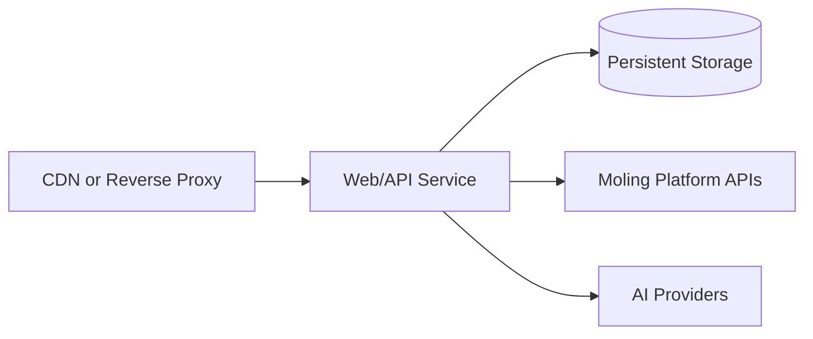

# Deployment Design

## Environments

- local development
- test/staging
- production

Each environment uses environment variables and secret management. No `.env` file with real values is committed.

## Runtime Topology



Current runtime in this branch is single-process: API, workspace, generation orchestration, and billing checks run together, with local JSON persistence.

## Current Docker Assets

- `ppt-ai-app/Dockerfile` builds the foundation API container.
- `docker-compose.yml` runs the app with environment-variable injection and a persistent `./data` volume.
- `docker-compose.prod.yml` provides a production-oriented example with fixed restart and healthcheck strategy.
- `.github/workflows/ci.yml` runs `npm test` for pushes and pull requests.

## Required Services (Current Phase)

- One app container built from `ppt-ai-app/Dockerfile`
- A data volume mounted to `/data` for `json:/data/ppt-ai-db.json` and stored uploads
- Optional reverse proxy (nginx/Traefik) and TLS termination
- Reachable Moling and AI provider endpoints

## Environment Variable Reference (Detailed)

| Variable | Required | Source | Where to get it | What it does |
|---|---|---|---|---|
| `MOLING_API_BASE_URL` | Yes | Moling platform config | Moling API Gateway / base host | The backend URL used to verify launch tickets and call entitlement APIs. |
| `INTERNAL_API_TOKEN` | Yes | Moling platform config | Internal service token on platform administration page | Signed secret for `/api/internal/*` calls. |
| `MOLING_APP_ID` | Optional (recommended) | Moling app management | App ID returned by `app create`/应用配置 | Verifies launched tickets are for this app. |
| `MOLING_PRODUCT_ID` | Optional (recommended) | Moling product management | Product ID from the PPT product entry | Verifies launch/product context and resolves default entitlement fallback. |
| `MOLING_USER_ENTITLEMENT_MAP` | Optional | Temporary deployment override | Manual mapping from Moling user IDs to their purchased entitlement IDs, for example `696:64,479:62` | Fallback used only when launch verification and `GET /api/internal/user-entitlements` do not return an entitlement. Prefer deploying the Moling internal lookup endpoint for production. |
| `MOLING_DEFAULT_ENTITLEMENT_ID` | Optional | Moling entitlement/package config | A default entitlement suitable for smoke testing or controlled single-user environments | Last-resort fallback when launch identity, user entitlement lookup, and `MOLING_USER_ENTITLEMENT_MAP` do not provide one. Leave empty for multi-user production unless intentional. |
| `SESSION_TTL_SECONDS` | Optional | Runtime policy | Any positive integer seconds, blank means default `604800` | Session expiry for `/` login cookies (defaults to 7 days in seconds). |
| `LOCAL_MOLING_MOCK` | Optional | Deployment mode | Set `true` for local integration tests | Enables local billing/session mock mode, bypassing external Moling API. |
| `LOCAL_MOLING_USER_ID` | Mock required | Local test setup | Any positive integer user id | Local mock session owner. |
| `LOCAL_MOLING_ENTITLEMENT_ID` | Mock required | Local test setup | Test entitlement id (e.g. `88`) | Local mock entitlement fallback and initial session selection. |
| `LOCAL_MOLING_INITIAL_CREDITS` | Optional | Local test setup | Number string such as `100` | Initial local mock remaining credits. |
| `LLM_PROVIDER` | Optional | Deployment variable | `mock` or `http` | Selects AI provider adapter. |
| `LLM_API_URL` | Required when `LLM_PROVIDER=http` | AI vendor dashboard | DeepSeek API URL (`https://api.deepseek.com/chat/completions`) | Request target for provider calls. |
| `LLM_API_KEY` | Usually required when `LLM_PROVIDER=http` | AI vendor dashboard | Generated API key | Bearer token for AI vendor authentication. |
| `LLM_MODEL` | Required for chat-completion providers | AI vendor model catalog | `deepseek-v4-flash` | Passed into request body as model name. |
| `LLM_TIMEOUT_MS` | Optional | Deployment variable | Default `30000` | Limits each provider request wall-clock time. |
| `LLM_MAX_RETRIES` | Optional | Deployment variable | Retry count for transient errors | Retries only timeout/5xx/fetch failures. |
| `APP_PORT` | Optional | Process environment | `5177` default | HTTP listening port. |
| `SESSION_COOKIE_SECURE` | Optional | Security policy | `true` behind HTTPS, `false` for direct HTTP access | Sets cookie `Secure` flag. Browsers will not store `Secure` session cookies over `http://`, so direct `:5177` deployments must set this to `false`. |

## Configuration

All settings are injected through environment variables:

- Moling base URL and internal token
- application URL and port
- session cookie lifetime through `SESSION_TTL_SECONDS` in seconds; default is 604800
- session cookie `Secure` behavior through `SESSION_COOKIE_SECURE`; defaults to production-safe values when `APP_ENV=production`
- database URL / storage path
- AI provider credentials
- logging level and tracing configuration

The reverse proxy should preserve the app's `X-Request-Id` response header so support tickets and Moling 联调 reports can be matched to backend logs.

For HTTP AI provider deployment, set:

- `LLM_PROVIDER=http`
- `LLM_API_URL`
- `LLM_API_KEY`
- `LLM_MODEL` (for example `deepseek-v4-flash` when using DeepSeek)
- `LLM_TIMEOUT_MS` to bound each provider request, default `30000`
- `LLM_MAX_RETRIES` for transient 5xx/network failures, default `0`

If `LLM_API_URL` points to `/chat/completions`, the app sends OpenAI-style requests automatically and parses the first choice JSON from:

`choices[0].message.content`

For local pre-production smoke tests without external Moling credentials, set `LOCAL_MOLING_MOCK=true` plus local user and entitlement IDs, then run `npm run acceptance`.

For real Moling platform acceptance, start the app with production-like Moling variables and pass a one-time launch ticket from the Moling entry flow:

```bash
ACCEPTANCE_BASE_URL=http://127.0.0.1:5177 \
ACCEPTANCE_LAUNCH_TICKET=<real_launch_ticket> \
ACCEPTANCE_ENTITLEMENT_ID=<optional_entitlement_id> \
npm run acceptance:moling
```

The acceptance script launches with `/?ticket=...` by default to match Moling's `access_url` ticket append behavior. Set `ACCEPTANCE_LAUNCH_PATH=/enter` only when the platform application access URL intentionally includes `/enter`.

The real acceptance script exercises SSO launch, template catalog, balance lookup, outline generation, outline editing, deck generation, single-slide regeneration, preview, PPTX/PDF export, file download, call-log checks, and final balance deduction checks against the configured Moling APIs.

## DeepSeek/Chat Completion Note

DeepSeek requires the endpoint to be set to the chat-completion path:

- `LLM_API_URL=https://api.deepseek.com/chat/completions`

The plain base URL (`https://api.deepseek.com`) is not enough because this app will switch to legacy contract mode unless `/chat/completions` is present.

## Production Deployment Steps

1. Configure production environment variables (example list):

   - `MOLING_API_BASE_URL`, `INTERNAL_API_TOKEN`
   - `MOLING_APP_ID`, `MOLING_PRODUCT_ID`
   - `MOLING_USER_ENTITLEMENT_MAP` only if the Moling internal user entitlement lookup endpoint is not deployed yet
   - `MOLING_DEFAULT_ENTITLEMENT_ID` only for controlled single-user smoke tests
   - `LLM_PROVIDER=mock` (local) or `LLM_PROVIDER=http` + `LLM_API_URL` and `LLM_API_KEY`
   - `APP_ENV=production`
   - `SESSION_COOKIE_SECURE=true` behind HTTPS; `SESSION_COOKIE_SECURE=false` when Moling opens the app over direct HTTP during testing
   - `LOCAL_MOLING_MOCK=false`

2. Start the service.

   `docker-compose.prod.yml` loads `ppt-ai-app/.env` by default, so production
   restarts do not require repeating every Moling and AI variable on the command
   line.

   ```bash
   docker compose -f docker-compose.prod.yml up -d --build
   ```

3. Run readiness and sanity checks:

   ```bash
   curl -fs http://127.0.0.1:5177/api/health
   ```

4. If `MOLING_USER_ENTITLEMENT_MAP` is configured, validate every mapped user and entitlement before accepting traffic:

   ```bash
   cd ppt-ai-app
   npm run validate:moling-config
   ```

   The command calls Moling `entitlement-balance` for each `user_id:entitlement_id` pair and fails if the entitlement does not belong to that user or cannot be read.

5. Run post-deploy acceptance:

   ```bash
   cd ppt-ai-app
   npm run acceptance
   ```

   In staging or production-linked environments, run `npm run acceptance:moling` with a valid launch ticket.

## Release Strategy

- Build immutable container images.
- Use health checks for rollout/rollback decisions.
- Keep rollback tags ready for one-click recovery if billing reconciliation risk is detected.

## Security Requirements

- Enforce HTTPS at the edge.
- Keep internal API tokens in secret storage.
- Restrict internal admin or reconciliation endpoints by network and authentication.
- Rotate provider keys and platform tokens without code changes.
