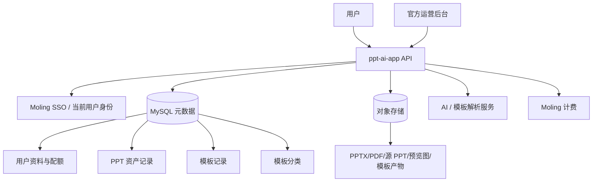
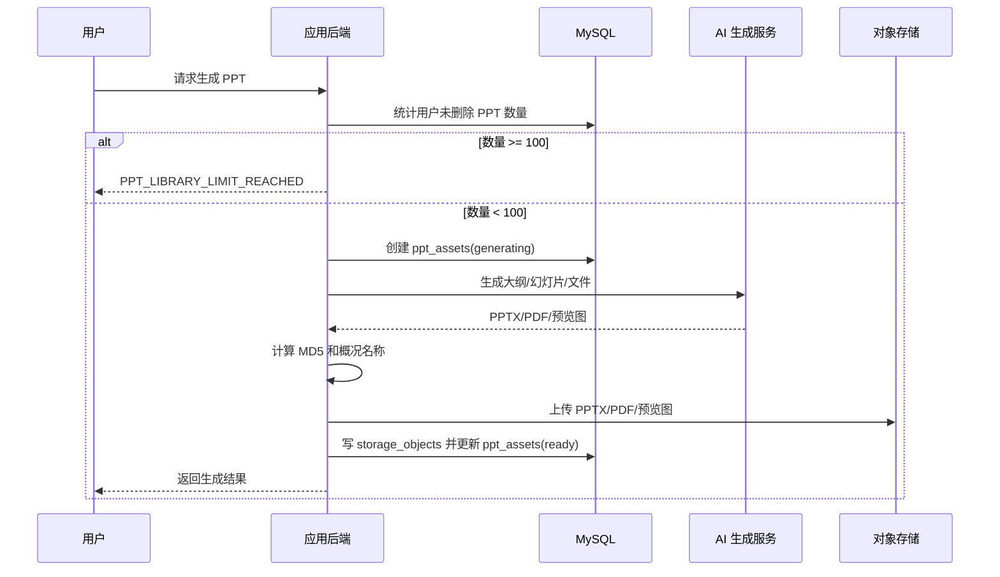
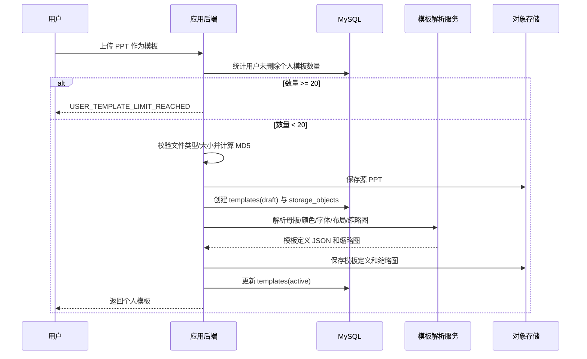

# PPT 资产库与模板体系设计

## 背景

AI PPT 应用需要从“即时生成和下载”扩展为“用户可长期管理的 PPT 资产库”和“可复用模板体系”。用户每次生成 PPT 后，应能在下次进入平台时查看历史生成结果；用户也可以上传自己的 PPT，由系统提取并生成个人模板。平台运营方也可以创建官方模板供用户使用。本文只描述设计，不包含实现代码。

## 目标

- 用户生成的 PPT 保留在平台资产库中，下次进入后可查看、预览、下载、删除。
- 每个用户最多保留 100 个生成 PPT，超过后禁止继续生成，并提示用户删除旧 PPT 后再生成。
- 用户可上传 PPT 文件，由系统生成对应的个人模板。
- 每个用户最多保留 20 个个人模板，超过后禁止继续创建，并提示用户删除无用模板后再新建。
- 官方可创建模板，并配置分类、可见范围和启停状态。
- 模板支持分类，用户可按分类选择模板并生成自己的 PPT 文件。
- PPT 展示名称可由系统根据随机文件名或生成主题做概况命名。
- 系统内部存储 PPT 文件、模板文件和模板派生产物时，以 MD5 值作为对象存储寻址和去重基础。
- 用户数据、PPT 元数据、模板元数据、分类、配额、权限关系使用 MySQL 存储。
- PPT 二进制、模板源文件、模板解析产物、预览图等大对象上传到对象存储。

## 非目标

- 本设计不实现代码。
- 本设计不替代现有 Moling SSO、计费、扣费和文件下载鉴权设计。
- 本设计不要求对象存储承担权限判断；权限判断统一在应用后端和 MySQL 元数据层完成。
- 本设计不要求第一期实现复杂在线模板编辑器，上传 PPT 自动解析为模板即可作为首版能力。

## 总体架构



核心原则：

- MySQL 是业务事实来源，所有权限、配额、分类、状态、归属关系以 MySQL 为准。
- 对象存储只保存文件内容，不暴露永久公开 URL。
- 文件对象 key 使用 MD5 分片，避免用户可控路径和重复文件重复存储。
- 生成、上传、删除都必须先写业务状态，再异步处理耗时任务，避免用户请求长时间阻塞。

## 领域模型

### 用户

用户身份来自 Moling SSO。应用本地 MySQL 保存最小用户资料和平台内配额统计。

建议字段：

- `id`: 应用内部用户 ID
- `moling_user_id`: Moling 用户 ID，唯一
- `display_name`: 展示名
- `avatar_url`: 头像
- `status`: `active` / `disabled`
- `created_at`, `updated_at`

### PPT 资产

一条 PPT 资产表示用户生成并保留在平台上的一次 PPT 结果。

建议字段：

- `id`
- `owner_user_id`
- `source_outline_id`
- `title`: 展示名称，系统可根据主题、随机文件名、第一页标题做概况命名
- `template_id`: 使用的模板 ID
- `category_id`: 生成时使用的模板分类
- `status`: `generating` / `ready` / `failed` / `deleted`
- `slide_count`
- `pptx_object_id`
- `pdf_object_id`
- `preview_object_id`
- `md5`: 主 PPTX 文件 MD5，便于定位和去重
- `generated_from`: `topic` / `document` / `uploaded_template` / `other`
- `created_at`, `updated_at`, `deleted_at`

配额规则：

- 查询 `owner_user_id = 当前用户` 且 `status != deleted` 的 PPT 资产数量。
- 当数量 `>= 100` 时，生成接口直接返回业务错误。
- 错误码建议：`PPT_LIBRARY_LIMIT_REACHED`
- 用户提示：`已保留 100 个 PPT，请删除不需要的 PPT 后再生成。`

### 模板

模板分为官方模板和用户模板。官方模板可供所有用户或指定范围使用；用户模板仅归属用户本人。

建议字段：

- `id`
- `owner_user_id`: 用户模板归属；官方模板为空
- `scope`: `official` / `user`
- `name`
- `description`
- `category_id`
- `status`: `draft` / `active` / `disabled` / `deleted`
- `source_ppt_object_id`: 用户上传或官方上传的源 PPT 文件
- `template_object_id`: 解析后的模板定义产物
- `thumbnail_object_id`
- `md5`: 源 PPT 或模板定义的 MD5
- `theme_config`: JSON，包含颜色、字体、布局、母版信息摘要
- `created_by`
- `created_at`, `updated_at`, `deleted_at`

用户模板配额规则：

- 查询 `owner_user_id = 当前用户`、`scope = user` 且 `status != deleted` 的模板数量。
- 当数量 `>= 20` 时，上传/创建模板接口直接返回业务错误。
- 错误码建议：`USER_TEMPLATE_LIMIT_REACHED`
- 用户提示：`已保留 20 个个人模板，请删除无用模板后再新建。`

### 模板分类

模板分类用于用户筛选模板和生成 PPT。

建议字段：

- `id`
- `parent_id`: 支持二级分类；首版可为空
- `name`: 如“商业汇报”“教育培训”“产品路演”“项目复盘”
- `slug`
- `sort_order`
- `status`: `active` / `disabled`
- `created_at`, `updated_at`

分类可同时挂官方模板和用户模板。用户查看模板时，结果由“官方可用模板 + 当前用户自己的模板”合并而成。

### 对象存储文件索引

所有对象存储文件都在 MySQL 保留索引。

建议字段：

- `id`
- `owner_user_id`: 用户文件归属；官方模板文件可为空或指向管理员
- `bucket`
- `object_key`
- `original_file_name`
- `display_file_name`
- `mime_type`
- `size_bytes`
- `md5`
- `sha256`: 可选，用于更强校验
- `file_role`: `generated_pptx` / `generated_pdf` / `template_source_pptx` / `template_definition` / `thumbnail` / `preview`
- `visibility`: `private` / `official`
- `status`: `available` / `deleted` / `orphaned`
- `created_at`, `updated_at`, `deleted_at`

## MySQL 表建议

```sql
users (
  id bigint primary key,
  moling_user_id bigint not null unique,
  display_name varchar(128),
  avatar_url varchar(512),
  status varchar(32) not null,
  created_at datetime not null,
  updated_at datetime not null
)
```

```sql
ppt_assets (
  id bigint primary key,
  owner_user_id bigint not null,
  source_outline_id varchar(64),
  title varchar(255) not null,
  template_id bigint,
  category_id bigint,
  status varchar(32) not null,
  slide_count int not null,
  pptx_object_id bigint,
  pdf_object_id bigint,
  preview_object_id bigint,
  md5 char(32),
  generated_from varchar(32),
  created_at datetime not null,
  updated_at datetime not null,
  deleted_at datetime,
  index idx_ppt_owner_status_created (owner_user_id, status, created_at),
  index idx_ppt_md5 (md5)
)
```

```sql
templates (
  id bigint primary key,
  owner_user_id bigint,
  scope varchar(32) not null,
  name varchar(128) not null,
  description varchar(512),
  category_id bigint,
  status varchar(32) not null,
  source_ppt_object_id bigint,
  template_object_id bigint,
  thumbnail_object_id bigint,
  md5 char(32),
  theme_config json,
  created_by bigint,
  created_at datetime not null,
  updated_at datetime not null,
  deleted_at datetime,
  index idx_template_owner_scope_status (owner_user_id, scope, status),
  index idx_template_category_status (category_id, status),
  index idx_template_md5 (md5)
)
```

```sql
template_categories (
  id bigint primary key,
  parent_id bigint,
  name varchar(64) not null,
  slug varchar(64) not null unique,
  sort_order int not null default 0,
  status varchar(32) not null,
  created_at datetime not null,
  updated_at datetime not null
)
```

```sql
storage_objects (
  id bigint primary key,
  owner_user_id bigint,
  bucket varchar(128) not null,
  object_key varchar(512) not null,
  original_file_name varchar(255),
  display_file_name varchar(255),
  mime_type varchar(128) not null,
  size_bytes bigint not null,
  md5 char(32) not null,
  sha256 char(64),
  file_role varchar(64) not null,
  visibility varchar(32) not null,
  status varchar(32) not null,
  created_at datetime not null,
  updated_at datetime not null,
  deleted_at datetime,
  unique key uk_bucket_object_key (bucket, object_key),
  index idx_storage_owner_role (owner_user_id, file_role),
  index idx_storage_md5 (md5)
)
```

## 对象存储设计

对象存储 key 不使用用户上传文件名，统一基于 MD5 分片：

```text
ppt-assets/{ownerUserId}/{md5[0:2]}/{md5}.{ext}
template-source/{ownerUserId}/{md5[0:2]}/{md5}.pptx
template-definition/{ownerUserId}/{md5[0:2]}/{md5}.json
official-template/{md5[0:2]}/{md5}.{ext}
preview/{ownerUserId}/{md5[0:2]}/{md5}.png
```

设计规则：

- 上传时流式计算 MD5。
- 相同用户上传相同 MD5 文件时可复用对象存储文件，但仍可创建新的业务记录。
- 不同用户的对象 key 默认隔离，即使 MD5 相同也不共用用户路径，避免后续删除和权限判断复杂化。
- 官方模板可使用独立 `official-template/` 前缀。
- 下载必须通过应用后端签发短期 URL 或代理下载，不能直接暴露长期对象 URL。

## PPT 生成与资产保留流程



生成后的 PPT 会出现在用户资产库中。用户下次进入平台时，后端根据 Moling 用户身份查询 `ppt_assets.owner_user_id`，只返回本人未删除的记录。

## 用户上传 PPT 生成个人模板流程



模板解析产物建议包括：

- 母版页结构摘要
- 标题页、目录页、内容页、结尾页布局
- 主题色、强调色、背景色
- 字体族和字号建议
- 占位符位置
- 缩略图

首版可以只提取颜色、字体、封面缩略图和基础布局，不要求完全还原复杂动画和高级图形。

## 官方模板创建流程

官方运营后台可以上传或创建模板：

1. 运营选择分类。
2. 上传源 PPT 或选择已有模板定义。
3. 系统计算 MD5 并上传对象存储。
4. 模板解析服务生成模板定义和缩略图。
5. 运营审核名称、描述、分类、可见状态。
6. 发布后模板进入 `official + active` 状态。

官方模板不占用户 20 个个人模板配额。

## 用户按分类生成 PPT 流程

1. 用户进入生成页面。
2. 前端请求模板分类列表。
3. 用户选择分类。
4. 后端返回该分类下的官方模板和用户本人模板。
5. 用户选择模板、输入主题或上传资料。
6. 后端检查用户 PPT 资产数量是否小于 100。
7. 生成 PPT 并保存到用户资产库。

模板列表查询规则：

```text
where status = active
and category_id = selected_category_id
and (
  scope = official
  or (scope = user and owner_user_id = current_user_id)
)
```

## 文件命名规则

系统需要同时保存展示名和存储名。

展示名：

- 优先使用用户输入主题。
- 其次使用第一页标题。
- 如果只有随机文件名，则从文件名中去掉扩展名、时间戳、UUID 片段后生成概况命名。
- 示例：`upload_9f4a21_market_report.pptx` 可展示为 `Market Report` 或 `市场报告`。

存储名：

- 不使用展示名。
- 使用 MD5 和固定前缀生成对象 key。
- MySQL `storage_objects.display_file_name` 保存展示名。

## 权限与安全

- 用户只能看到自己的 PPT 资产和个人模板。
- 用户可看到官方发布且可见范围命中的模板。
- 用户删除 PPT 或模板时，优先软删除 MySQL 记录，异步清理对象存储。
- 对象存储文件禁止公开读。
- 下载链接必须短期有效，并绑定用户、文件 ID、过期时间和签名。
- 上传 PPT 必须限制文件类型、大小，并扫描恶意内容。
- 模板解析服务不能直接信任 PPT 内部宏或嵌入对象，首版建议拒绝含宏文件。

## 配额与并发一致性

PPT 100 个和模板 20 个限制必须在事务中校验。

建议：

- MySQL 使用事务。
- 在生成或创建前对用户配额行加锁，或使用单独的 `user_usage_counters` 表。
- 创建记录成功后计数加一。
- 删除记录成功后计数减一。
- 如果生成失败且未形成可用 PPT，回滚或将记录标记为 `failed`，不计入“可保留 PPT”数量。

可选计数表：

```sql
user_usage_counters (
  user_id bigint primary key,
  active_ppt_count int not null default 0,
  active_user_template_count int not null default 0,
  updated_at datetime not null
)
```

## API 草案

### 用户 PPT 资产

- `GET /api/ppt/assets`：查询当前用户 PPT 资产列表。
- `GET /api/ppt/assets/{asset_id}`：查看详情。
- `DELETE /api/ppt/assets/{asset_id}`：软删除。
- `POST /api/ppt/decks`：生成 PPT；生成成功后创建或更新 `ppt_assets`。

超限响应：

```json
{
  "error": {
    "code": "PPT_LIBRARY_LIMIT_REACHED",
    "message": "已保留 100 个 PPT，请删除不需要的 PPT 后再生成。"
  }
}
```

### 模板

- `GET /api/template-categories`：查询分类。
- `GET /api/templates?category_id=...`：查询官方模板和个人模板。
- `POST /api/user-templates`：上传 PPT 并创建个人模板。
- `DELETE /api/user-templates/{template_id}`：删除个人模板。
- `POST /api/admin/templates`：官方创建模板。
- `PATCH /api/admin/templates/{template_id}`：官方编辑、发布、下架模板。

个人模板超限响应：

```json
{
  "error": {
    "code": "USER_TEMPLATE_LIMIT_REACHED",
    "message": "已保留 20 个个人模板，请删除无用模板后再新建。"
  }
}
```

## 与现有模块的关系

- `PptService`：负责生成 PPT，并在生成成功后创建 PPT 资产记录。
- `TemplateManager`：扩展为读取 MySQL 模板和分类，不再只依赖内置模板数组。
- `Files`：扩展为对象存储适配器，统一保存 generated PPT、PDF、模板源文件和缩略图。
- `Auth`：继续通过 Moling SSO 获取当前用户，并映射到本地 `users`。
- `Billing`：生成 PPT 仍按现有扣费流程执行；配额检查应在扣费 reserve 前完成。
- `Admin`：新增官方模板管理能力。

## 测试与验收建议

- 用户生成第 100 个 PPT 成功，第 101 个返回 `PPT_LIBRARY_LIMIT_REACHED`。
- 用户删除 1 个旧 PPT 后，可以继续生成。
- 用户创建第 20 个个人模板成功，第 21 个返回 `USER_TEMPLATE_LIMIT_REACHED`。
- 用户删除 1 个个人模板后，可以继续创建。
- 用户只能看到自己的 PPT 和个人模板。
- 用户可以看到官方 active 模板。
- disabled/deleted 官方模板不出现在普通用户模板列表。
- 模板分类筛选结果正确合并官方模板和用户模板。
- 上传同一 PPT 文件时，MD5 一致，对象存储 key 稳定。
- 删除 PPT 或模板不会立即暴露对象存储文件，下载接口必须返回不可访问。
- 生成 PPT 时先检查 100 个配额，再进入扣费 reserve。

## 分阶段落地建议

### Phase 1：资产库元数据

- 引入 MySQL 表：`users`、`ppt_assets`、`storage_objects`。
- 生成 PPT 后保存资产记录。
- 实现用户资产列表和删除。
- 实现 100 个 PPT 配额。

### Phase 2：对象存储

- 引入对象存储适配器。
- 使用 MD5 key 保存 PPTX/PDF/预览图。
- 下载改为短期签名或后端代理。

### Phase 3：模板分类和官方模板

- 引入 `template_categories` 和 `templates`。
- 官方后台创建、发布、下架模板。
- 用户按分类选择模板生成 PPT。

### Phase 4：用户个人模板

- 用户上传 PPT。
- 模板解析服务生成模板定义和缩略图。
- 实现 20 个个人模板配额。
- 个人模板与官方模板合并展示。

## 风险与取舍

- MD5 适合去重和稳定寻址，但不是安全签名；权限仍必须依赖 MySQL 和后端鉴权。
- 对象存储删除建议异步执行，避免用户请求等待外部存储。
- PPT 模板解析质量会决定个人模板可用性，首版应明确“不完全还原复杂动画和宏”。
- 100 个 PPT 和 20 个模板配额需要事务保护，否则并发请求可能绕过限制。
- 用户上传模板可能包含敏感信息，模板默认仅本人可见，除非用户明确发布或管理员审核。
