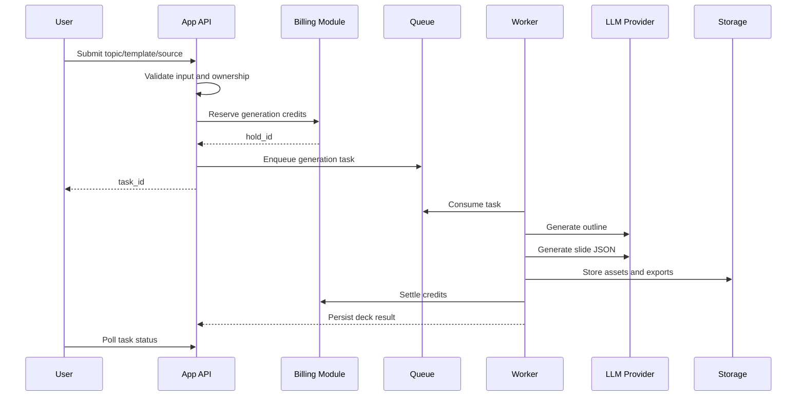

# AI PPT Workflow

## Generation Flow

## Steps

1. User enters from Moling and opens the PPT workspace.
2. User chooses a template or starts from a topic/source file.
3. Backend validates ownership, rate limits, and credit eligibility.
4. Backend generates an editable outline and stores it.
5. User edits the outline.
6. Billing module reserves estimated credits before expensive deck generation.
7. AI provider generates slide content and layout metadata.
8. Backend persists normalized deck and slide data.
9. Backend settles reserved credits on success or releases them on failure.
10. User previews the generated deck and exports PPTX/PDF files.

## AI Stages

- Intent parsing: normalize topic, audience, tone, language, and slide count.
- Outline generation: produce section titles and slide-level plan.
- Slide JSON generation: produce structured content for each slide.
- Layout selection: map slide intent to reusable layouts.
- Asset generation: create or fetch images where needed.
- Export preparation: render to PPTX/PDF in a deterministic worker.

## Failure Handling

- If reserve fails, do not enqueue AI work.
- If AI generation fails after reserve, release the hold.
- If releasing a failed generation hold fails, mark the task as `release_pending` and retry release through `POST /internal/reconcile` before allowing generation retry.
- Failed generation tasks are marked retryable and can be retried from the original outline.
- If settle fails after successful generation, mark the task as `reconcile_pending`, keep the deck as `billing_pending`, block preview/export/slide regeneration, and retry settlement through `POST /internal/reconcile`.
- If export fails, keep the editable deck and allow retry without regenerating content.
